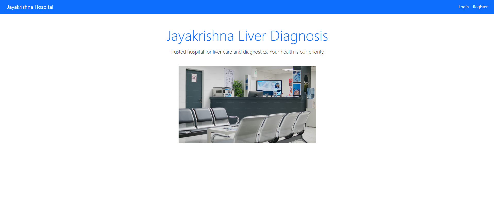
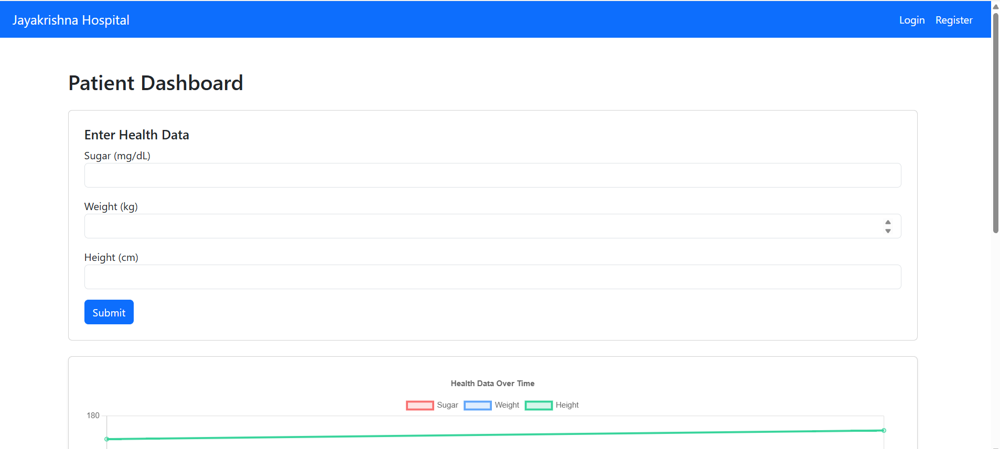
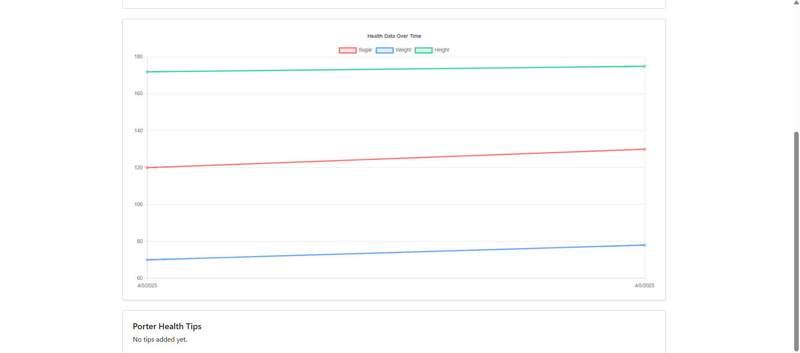
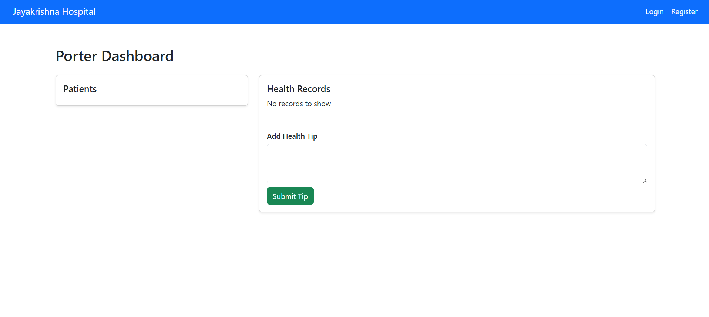

<h3>Jayakrishna liver daignosis Hospital management</h3>

<h4>Homepage</h4>

<h4>Patient Homepage</h4>

<h4>Patient Homepage</h4>

<h4>Patient Homepage</h4>

try to use as porter and patient roles.

 
@jayakrishna2025

In the project directory, you can run: 
------clone the project with clone url -------
### `npm start`

Runs the app in the development mode.\
Open [http://localhost:3000](http://localhost:3000) to view it in your browser.

The page will reload when you make changes.\
You may also see any lint errors in the console.

### `npm test`

Launches the test runner in the interactive watch mode.\

### `npm run build`

Builds the app for production to the `build` folder.\
It correctly bundles React in production mode and optimizes the build for the best performance.

The build is minified and the filenames include the hashes.\
Your app is ready to be deployed!

